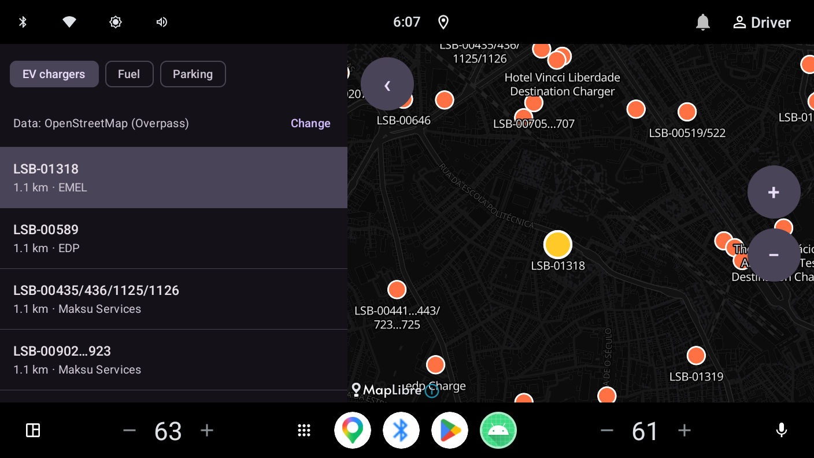
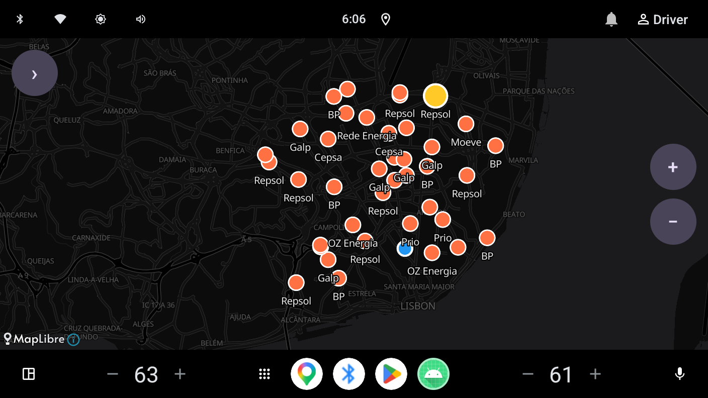
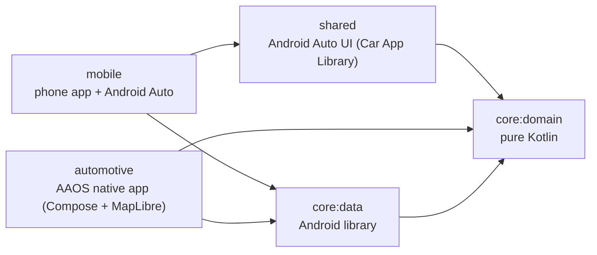
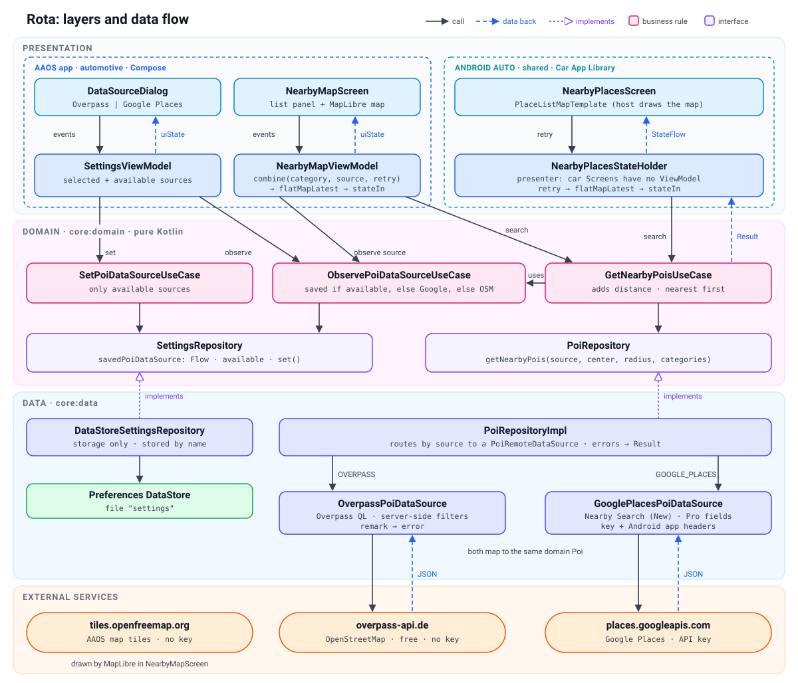

# Rota

Find **EV chargers, fuel stations and parking** near you, in the car.

Rota runs on both car platforms:

| Platform | What it is | How Rota's UI is built |
|---|---|---|
| **Android Automotive OS (AAOS)** | Android built into the car | A **native app** (Jetpack Compose) that draws its own map with **MapLibre**: a list panel next to a map, as a car maker's navigation app would |
| **Android Auto** | The phone's app projected to the car's screen | **Car App Library templates** (`PlaceListMapTemplate`), the only UI Android Auto allows for third-party apps |

Both share the same domain and data layers. Places come from **OpenStreetMap (Overpass API)**, free and without a key, or from **Google Places (New)** with an API key; the user can switch between them.

## Screenshots

AAOS emulator (Automotive 1408×792), data from OpenStreetMap:

<p>
  
  
</p>

| EV chargers: list ↔ map selection | Fuel stations: panel folded, full-width map |
|---|---|
| Selecting a row highlights the charger on the map (yellow), and the other way round; nearest first, with distance and operator | The ‹ / › button folds the list so the map uses the whole screen; zoom with + / − |

## Features

- Nearby EV chargers, fuel stations and parking, **nearest first**, with distance and address
- **AAOS**
  - Dark map with OpenStreetMap tiles (MapLibre + OpenFreeMap, no key)
  - Category chips, list ↔ map selection (tap a row or a place on the map), own +/− zoom buttons
  - **Collapsible list panel** for a full-width map
  - **Data source setting** (OpenStreetMap / Google Places), saved across restarts; changing it searches again
  - Loading, empty, error (*No connection* / *Map service busy*) with **Retry**
- **Android Auto**: places on the host's map with numbered markers, list limited to what the car allows, Retry on errors

> The search centre is currently fixed to Lisbon city centre; real location is on the roadmap.

## Architecture

Clean Architecture in Gradle modules: dependencies point **inward** to `core:domain`, which is pure Kotlin.

### Modules



| Module | Type | Contains |
|---|---|---|
| `core:domain` | Kotlin/JVM (no Android) | Models (`Poi`, `NearbyPoi`, `PoiCategory`, `PoiDataSource`), repository interfaces, use cases, distance (haversine), search config |
| `core:data` | Android library | Overpass and Google Places clients (Retrofit), DTOs + mappers, data sources, repositories, DataStore settings, Hilt modules |
| `shared` | Android library | Android Auto: `CarAppService`, `Session`, `Screen`, presenter |
| `automotive` | AAOS app | `MainActivity`, ViewModels, Compose screens, MapLibre map |
| `mobile` | Phone app | Hosts the Android Auto service (phone UI not built yet) |

- **`core:domain` is a JVM module**, so the compiler rejects Android imports: the domain rule is enforced, not just a convention.
- **`shared` depends only on `core:domain`**: car screens can't reach DTOs or Retrofit.
- **The apps depend on `core:data`** so Hilt can build the full dependency graph.

### Layers and data flow



Presentation talks only to use cases; use cases hold the business rules and depend on repository
interfaces; the data layer implements them and talks to the external services.

### Domain

- **Use cases hold the business rules**
  - `GetNearbyPoisUseCase`: reads the chosen source, calls the repository, adds distances and **sorts nearest first** (car screens show only a few items, so the order matters).
  - `ObservePoiDataSourceUseCase`: *saved choice if it's available, else Google Places if a key exists, else Overpass*.
  - `SetPoiDataSourceUseCase`: an unavailable source can't be chosen.
- **Repositories are interfaces** using domain types only. `PoiRepository.getNearbyPois(source, center, radius, categories)` takes the source explicitly, so the data layer just routes.
- One use case reuses another (`GetNearbyPoisUseCase` → `ObservePoiDataSourceUseCase`) instead of copying the rule.

### Data: one repository, several data sources

```
PoiRepositoryImpl                 routes by source; the only place exceptions become Result
 ├─ OverpassPoiDataSource         Overpass QL query, server-side filters, `remark` → error
 └─ GooglePlacesPoiDataSource     Nearby Search (New), JSON body, Pro field mask
     both implement PoiRemoteDataSource and map to the same domain Poi
```

- **Each API has its own DTOs and mapper**; the domain model is source-independent (e.g. OSM's `socket:type2_combo` becomes `ConnectorType.CCS`, a type any other source can map to as well).
- **Two Retrofit instances** (one per base URL) share one `OkHttpClient` (`newBuilder()`), distinguished by Hilt qualifiers (`@OverpassRetrofit`, `@GooglePlacesRetrofit`, `@OverpassSource`, `@GooglePlacesSource`).
- **Errors**: data sources throw; the repository returns `Result` and rethrows `CancellationException`. Invalid input (radius ≤ 0) is checked *before* the `try`, because `SerializationException` is an `IllegalArgumentException` and must become a failure, not a crash.
- **Settings**: `DataStoreSettingsRepository` stores the chosen source in Preferences DataStore (by enum name); it's storage only, the rule lives in the domain.

### Presentation

**AAOS (native app, `automotive`)**
- `@HiltViewModel NearbyMapViewModel` with a Flow pipeline:
  ```
  combine(selectedCategory, dataSource, retryTrigger) → flatMapLatest { Loading; search } ─┐
                                                                                         ├→ combine → stateIn → uiState
  screenState (selection, panel, dialog, map layout) ─────────────────────────────────────┘
  ```
  - `flatMapLatest` cancels an outdated search; `SharingStarted.Lazily` keeps results.
  - **Screen state is combined after the search**, so folding the panel or selecting a place never sends a new request.
  - **No `remember { mutableStateOf }` for screen state**: composables are stateless (state in, events out); everything the screen shows is in `uiState` and unit-tested.
- **MapLibre in Compose**: `MapView` in `AndroidView` with lifecycle forwarding; places drawn as **GeoJSON layers** (circles, labels, selection highlight); a plain `PlacesMapController` applies data once the style has loaded.

**Android Auto (templates, `shared`)**
- Car App Library `Screen`s aren't `ViewModelStoreOwner`s, so a plain **presenter** (`NearbyPlacesStateHolder`) plays the ViewModel's role in the Screen's `lifecycleScope`; it's JVM-testable.
- Hilt can't inject `Session` / `Screen`: dependencies are injected into the `@AndroidEntryPoint CarAppService` and passed down.
- Host limits respected: list cut to `ConstraintManager`'s limit, `invalidate()` only on real state changes (refresh rate), errors stay in the same template type (step limit).

## Key technical decisions

| Decision | Why |
|---|---|
| **MapLibre instead of the Google Maps SDK on AAOS** | The Maps SDK isn't among the [Google Play services available on Android Automotive OS](https://developer.android.com/training/cars/google-services); it shows "Google Play services updating" forever. MapLibre needs no Play services and no key |
| **Native UI on AAOS, templates on Android Auto** | Car makers' navigation apps are native AAOS apps; Android Auto only allows templates for third-party apps |
| **POI app category** (`androidx.car.app.category.POI`) | Rota finds places and hands navigation to a navigation app; the navigation category requires turn-by-turn guidance |
| **Overpass + Google Places, user-selectable** | Overpass is free but public servers are often busy (429/504); Google Places is reliable but needs a key and billing. Without a key the app still works |
| **Google Places Pro field mask only** | The most expensive field in the mask sets the price of every request; Pro has 5,000 free requests per month |
| **Flow pipeline over imperative loading** | New inputs (data source now, location next) are just another `combine` input |
| **Explicit library versions** | Checked against Kotlin 2.2.10 (e.g. libraries built with Kotlin 2.4 can't be used); one shared version for all Car App Library artifacts |

## Tech stack

| Area | Library / tool |
|---|---|
| Language / build | Kotlin 2.2.10, Gradle 9.6, AGP 9.4.1 (built-in Kotlin), version catalog, KSP |
| DI | Hilt 2.60.1 |
| Async | Kotlin Coroutines 1.10.2, Flow |
| Network | Retrofit 3.0.0, OkHttp 5.5.0, kotlinx.serialization 1.9.0 |
| Storage | DataStore Preferences 1.2.1 |
| AAOS UI | Jetpack Compose (Material 3), Lifecycle 2.11, Hilt ViewModel Compose, **MapLibre Android 13.6.1** |
| Android Auto UI | Car App Library 1.7.0 |
| Tests | JUnit 4, kotlinx-coroutines-test, hand-written fakes |
| Min / target SDK | 29 / 37 |

## Getting started

### Requirements
- Android Studio; Gradle provisions its JDK 25 daemon toolchain automatically (code targets Java 11)
- An **Automotive** emulator image *with Google Play* (e.g. "Automotive 1408p landscape")

### Run on AAOS
```bash
./gradlew :automotive:installDebug
adb shell am start -n com.majidbahmani.rota/.MainActivity
```
In Android Studio, choose the **`automotive`** run configuration and the Automotive device. `mobile` and `automotive` share the package name, so running `mobile` on the car emulator replaces the AAOS app.

### Run on Android Auto
Install `mobile` on a phone (or phone emulator) with Android Auto, and use the [Desktop Head Unit](https://developer.android.com/training/cars/testing/dhu) as the car screen.

### Optional: Google Places API key
Without a key, Rota uses Overpass. To enable Google Places:

1. In Google Cloud Console, enable **Places API (New)** and create an API key.
2. Restrict it to **Android apps**: package `com.majidbahmani.rota` and your signing certificate's SHA-1 (`./gradlew signingReport`), and to **Places API (New)** only.
3. Set a **daily quota** and a **budget alert** to avoid surprise charges.
4. Add it to `local.properties` (gitignored) and rebuild:
   ```properties
   MAPS_API_KEY=your_key
   ```

The key goes `local.properties` → `BuildConfig` → an OkHttp interceptor that sends `X-Goog-Api-Key`, `X-Android-Package` and `X-Android-Cert`. The certificate fingerprint is read from the app's own signature at runtime, so every developer's debug key works without code changes.

> **Security note:** a key inside an APK isn't secret: the key, package name and certificate fingerprint can all be read from the APK. The Android restriction stops casual misuse; quotas limit damage. In production the key would sit behind a backend that calls Google.

## Testing

**95 JVM unit tests**, no emulator needed:

```bash
./gradlew :core:domain:test :core:data:testDebugUnitTest :shared:testDebugUnitTest :automotive:testDebugUnitTest
```

| Module | Tests | Covers |
|---|---|---|
| `core:domain` | 16 | Distance, sorting, data source rules |
| `core:data` | 53 | DTO decoding (Overpass sample from Lisbon), mappers, query building, data sources, repository routing and errors, Google headers interceptor, DataStore (real file in a temp folder) |
| `shared` | 9 | Android Auto presenter: states, retry, cancellation of outdated searches |
| `automotive` | 17 | ViewModels: categories, data source changes, selection, panel, dialog |

- **Fakes over mocks**: domain interfaces make hand-written fakes easy; repository fakes can suspend until the test answers, to test cancellation and ordering.
- **Coroutines**: `runTest`, `runCurrent()`, a `MainDispatcherRule` for `viewModelScope`, collectors in `backgroundScope` for lazy `StateFlow`s.

## Known limitations

- Search centre fixed to Lisbon (no real location yet).
- Public Overpass servers rate-limit (HTTP 429) and are sometimes busy (504): the app shows *Map service busy* with Retry.
- Dense results (e.g. parking in a city centre) overlap on the map; OSM sometimes has the same car park twice.
- The Google Places sample used in tests follows Google's documented response shape (no captured response yet).
- No offline cache; the phone app UI isn't built.

## Roadmap

1. Automatic retry with backoff for Overpass 429/504
2. Marker clustering and merging of duplicate places
3. Real location (permission flow, search again after the car moves a minimum distance)
4. AAOS driving restrictions (`CarUxRestrictionsManager`)
5. Google API key entered at runtime (stored encrypted)
6. Offline cache by area (Room), route preview, CI with GitHub Actions

## Attribution

Map data and tiles: © OpenStreetMap contributors, © OpenMapTiles, tiles by [OpenFreeMap](https://openfreemap.org). Rendering: [MapLibre](https://maplibre.org).
